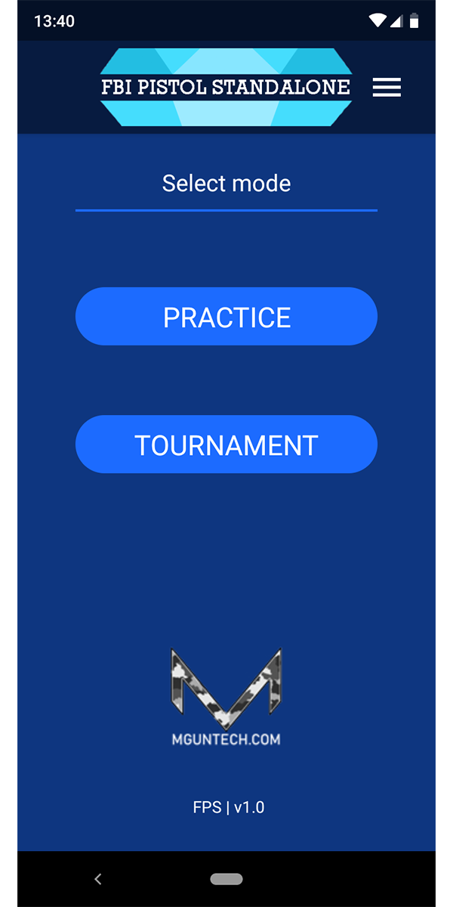
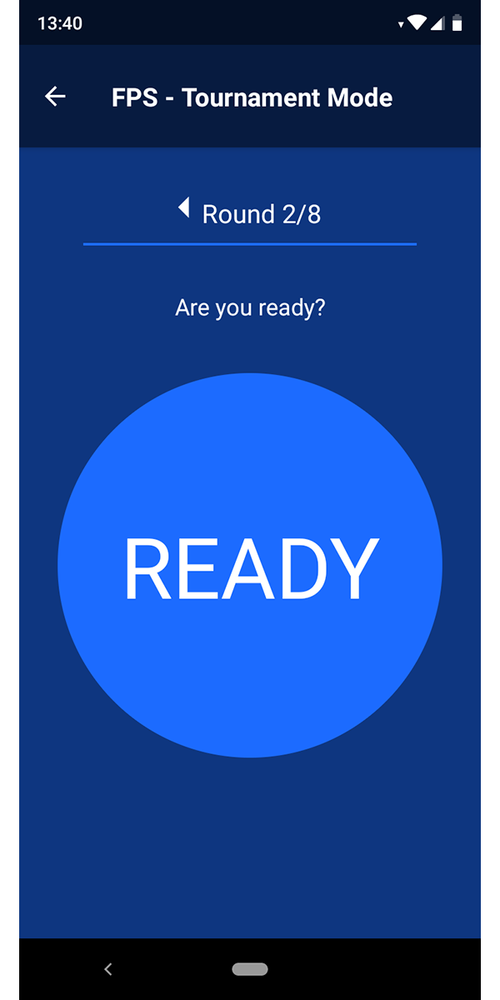
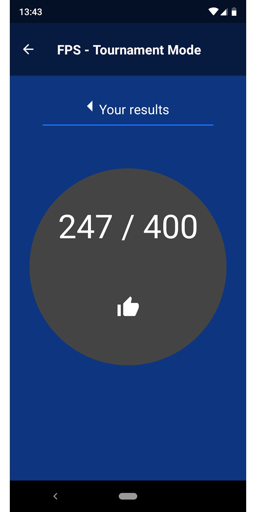

# FPS: FBI Pistol Standalone 

FPS (FBI Pistol Standalone) is a mobile shooting simulator designed to replicate FBI-style target practice without the need for automated targets or a shooting instructor, using a beeper that indicates when the round starts and finishes.

Note: This app is no longer maintained in Google Playstore, but feel free to build your own. All required source code is in here :)

## 🚀 Getting Started

### Prerequisites
- Node.js
- Expo CLI (`npm install -g expo-cli`)
- Android Studio (for mobile emulation)

### Run the project or build your own APK

Test locally: `expo start`

Build APK: `expo build:android`

